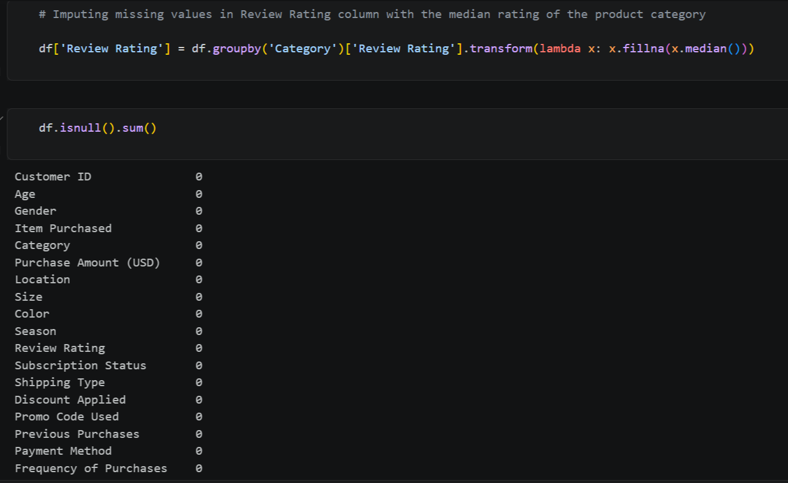
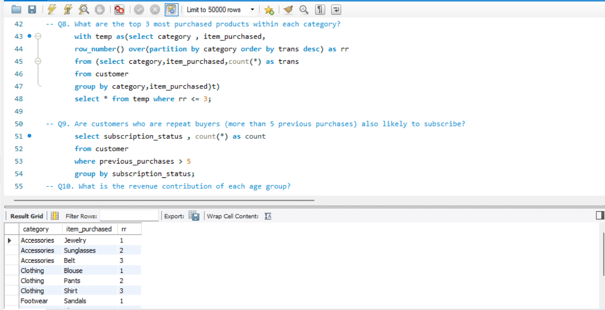
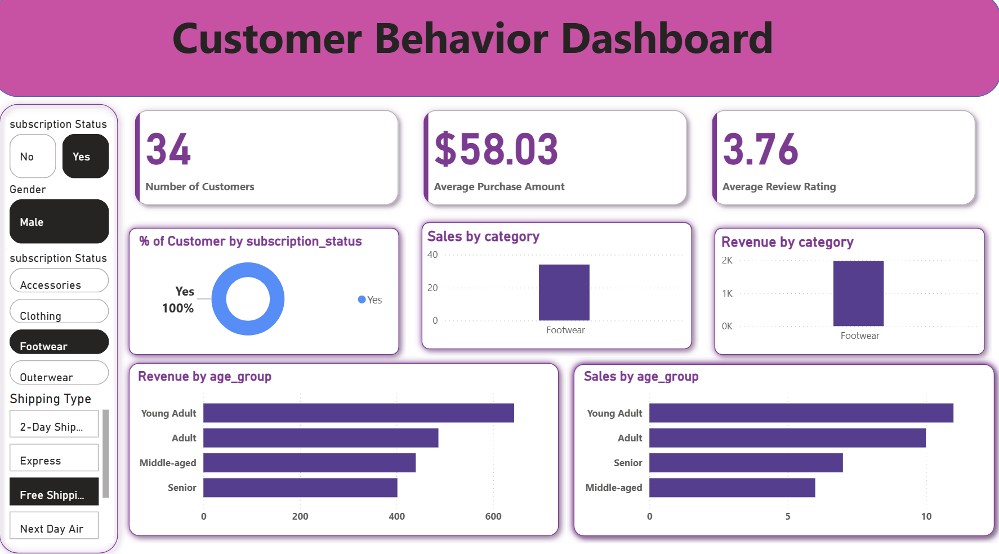

# 🛍️ Customer Shopping Behavior Analysis

An end-to-end data analytics project focused on analyzing customer shopping behavior, purchasing patterns, product performance, and subscription trends using **Python, MySQL, and Power BI**.

## 🛠️ Tools & Technologies

- Python
- Pandas
- MySQL
- Power BI

## 🔄 Project Workflow

**Raw Data → Python Data Cleaning & Feature Engineering → MySQL Analysis → Power BI Dashboard**

---

## 🐍 1. Data Cleaning & Feature Engineering

The dataset was cleaned and prepared using Python and Pandas.

Key steps:

- Explored the dataset and checked data quality
- Handled missing values in `Review Rating`
- Imputed missing ratings using category-wise median
- Standardized column names
- Created `age_group`
- Created `purchase_frequency_days`
- Removed redundant columns

---

## 🗄️ 2. Business Analysis using MySQL

The cleaned data was loaded into MySQL for business-oriented SQL analysis.

Key areas analyzed:

- Revenue by gender
- High-spending customers using discounts
- Top-rated products
- Shipping type analysis
- Subscription behavior
- Discount-dependent products
- Customer segmentation
- Top 3 products within each category
- Repeat buyers and subscription behavior
- Revenue by age group

SQL techniques used include:

- Aggregate functions
- `GROUP BY`
- Subqueries
- CTEs
- Window functions
- `ROW_NUMBER()`

---

## 📊 3. Power BI Dashboard

An interactive dashboard was created in Power BI to visualize customer and sales behavior.

### Key KPIs

- **Total Customers** — `COUNTROWS`
- **Average Purchase Amount** — `AVERAGE`
- **Average Review Rating** — `AVERAGE`

The dashboard includes:

- Customer distribution by subscription status
- Sales by category
- Revenue by category
- Revenue by age group
- Sales by age group
- Interactive filters for customer and purchase attributes

---

## 💡 Key Insights

- Young Adults contributed the highest revenue among the analyzed age groups.
- Customer behavior varies across subscription status, product categories, and age groups.
- Purchase history can be used to identify New, Returning, and Loyal customers.
- Product and discount analysis can help improve marketing and customer retention strategies.

---

---

## 🎯 Skills Demonstrated

**Python • Pandas • SQL • MySQL • Power BI • Data Cleaning • Data Visualization • Business Analysis**
